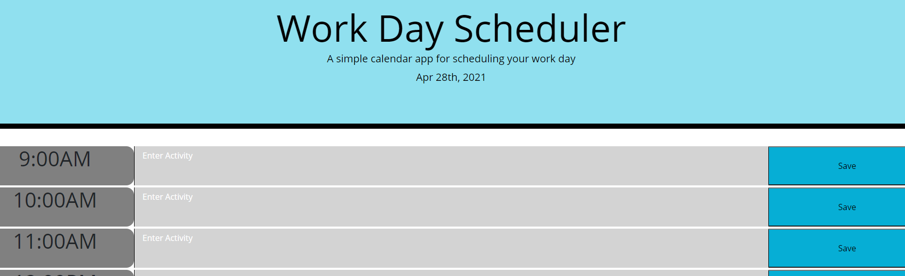

# Day Planner

## Description

This is an interactive application that allows users to input daily activities, to-do lists, or reminders into an organized planner and save them in local storage.
### Features

This web application also displays the inputed activities in a color-coded way to help you keep organized: grey is the past, red is the present, and green is the future.

### Visuals

### Links
[deployedApplication] https://will98nicholson.github.io/Plan-Ahead-/.
